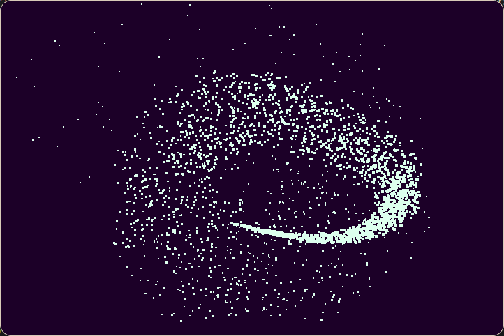
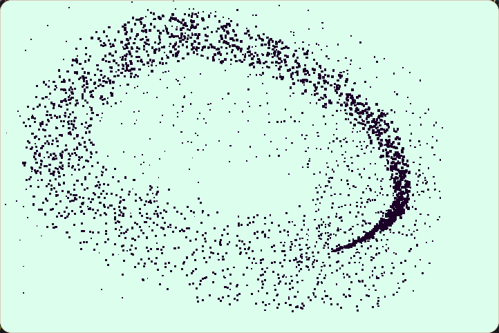

# particle-garden
little pixels, all over the screen.. (C++/SDL3)

little experiment in sdl3 written in c++, move the mouse to have particles appear, click anywhere to invert the colours.

<p align="center">
  
  
</p>

## build & run
for linux:
```shell
bash../build.sh --clean
build/particle-garden
```


for windows:
```ps1
coming eventually  ¯\(ツ)/¯ 
``` 